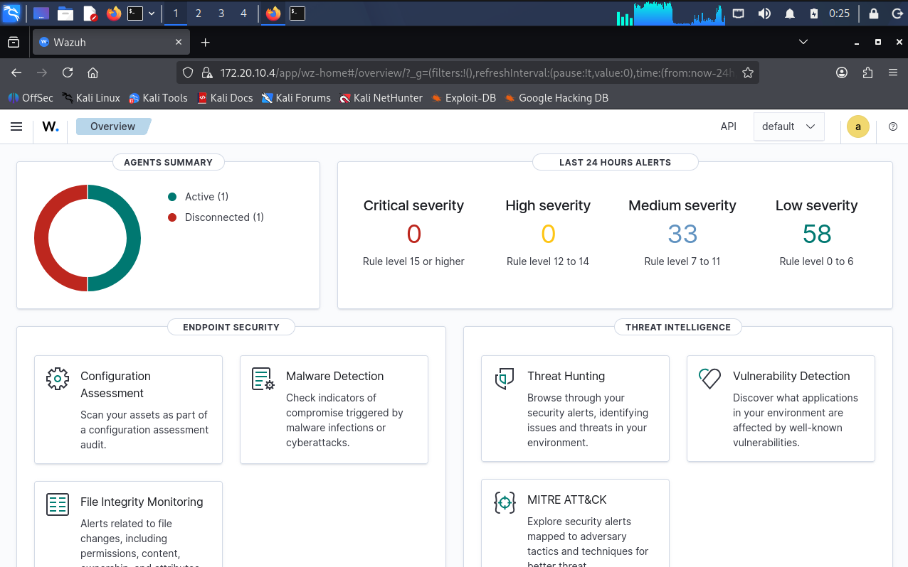
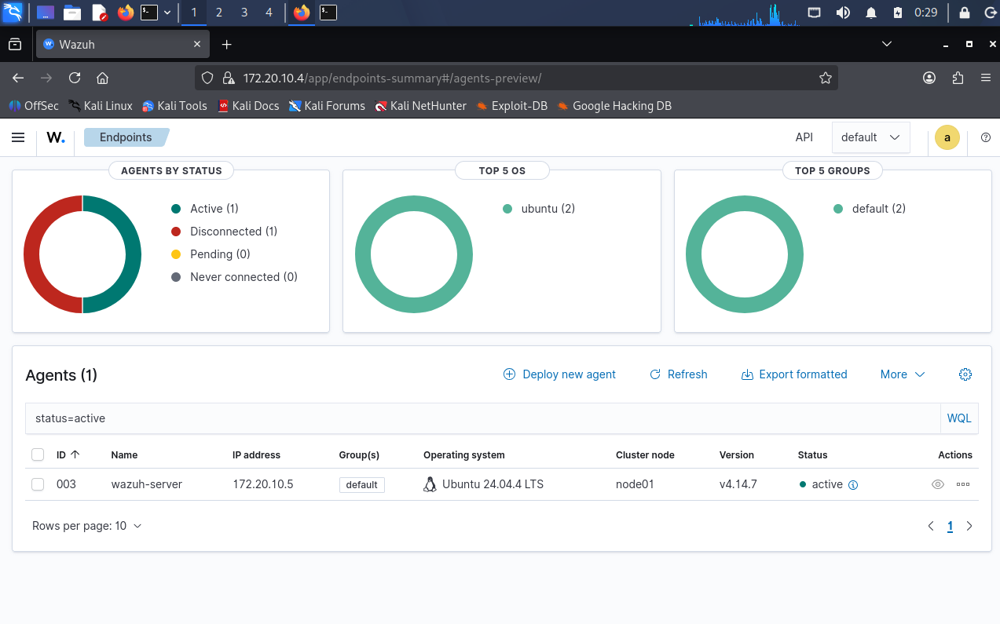
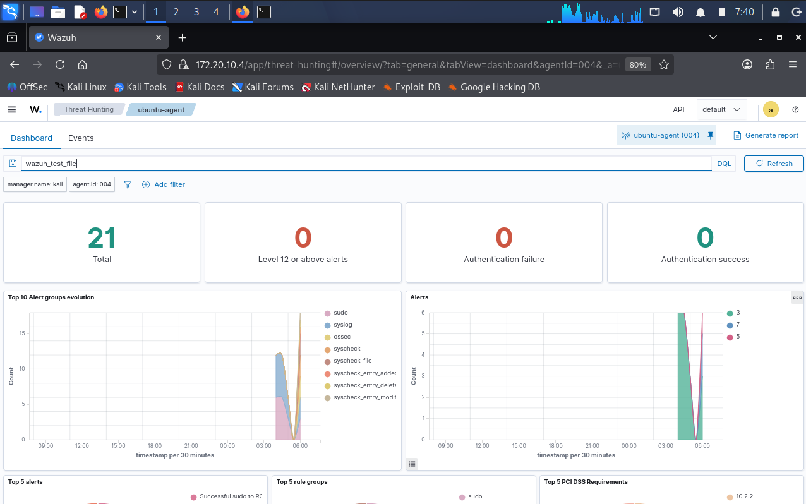
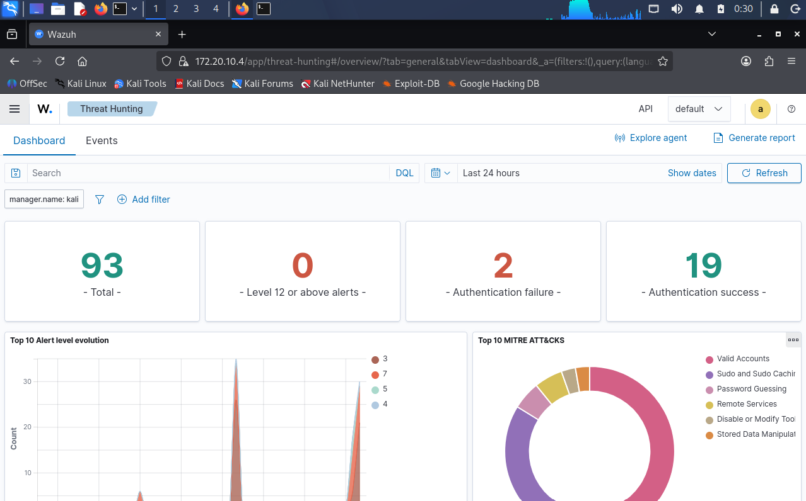

# Wazuh-SOC-Home-Lab

A hands-on Security Operations Center (SOC) home lab built to simulate real-world enterprise monitoring using **Wazuh SIEM**, **Ubuntu Server**, **Kali Linux**, and **Metasploitable 2**.

This project demonstrates endpoint monitoring, file integrity monitoring (FIM), log analysis, vulnerability detection, and incident investigation in a controlled lab environment.

---

# Project Overview

This lab was designed to provide practical SOC experience by building and configuring a Security Information and Event Management (SIEM) solution from scratch.

The objective is to simulate enterprise monitoring while documenting every step, investigation, and alert generated throughout the project.

---

# Lab Architecture

```
                    +----------------------+
                    |      Kali Linux      |
                    |  Security Analyst    |
                    +----------+-----------+
                               |
                               |
                    HTTPS (Dashboard)
                               |
                               |
                +--------------+--------------+
                |     Ubuntu Server           |
                |       Wazuh Server          |
                |-----------------------------|
                | Wazuh Manager               |
                | Wazuh Dashboard             |
                | Wazuh Indexer              |
                +--------------+--------------+
                               |
                -------------------------------
                |                             |
                |                             |
        Wazuh Agent                  Wazuh Agent
                |                             |
        Ubuntu Endpoint          Metasploitable 2
```

---

# Technologies Used

- Wazuh SIEM
- Ubuntu Server
- Kali Linux
- Metasploitable 2
- VirtualBox
- Linux
- SSH
- File Integrity Monitoring (FIM)
- Syscheck
- Git
- GitHub

---

# Skills Demonstrated

- SIEM Deployment
- Security Monitoring
- Linux Administration
- Threat Detection
- Endpoint Monitoring
- File Integrity Monitoring
- Incident Investigation
- Alert Analysis
- Log Management
- Security Documentation
- Git Version Control

---

# Lab Components

| Component | Purpose |
|-----------|----------|
| Kali Linux | SOC Analyst workstation |
| Ubuntu Server | Wazuh Manager, Dashboard & Indexer |
| Metasploitable 2 | Vulnerable endpoint |
| Wazuh Agent | Endpoint monitoring |
| Wazuh Dashboard | Alert visualization |

---

# Project Structure

```
Wazuh-SOC-Home-Lab/
│
├── README.md
├── LICENSE
├── .gitignore
│
├── 01-Lab-Overview/
│   ├── Lab-Objectives.md
│   ├── Architecture.md
│   └── Technologies.md
│
├── 02-Lab-Setup/
│   ├── VMware-Configuration.md
│   ├── Network-Configuration.md
│   ├── Wazuh-Installation.md
│   ├── Ubuntu-Agent-Installation.md
│   └── Screenshots/
│
├── 03-Agent-Enrollment/
│   ├── Agent-Registration.md
│   ├── Troubleshooting.md
│   └── Screenshots/
│
├── 04-Detection-Lab/
│
├── 05-Attack-Simulation/
│
├── 06-Incident-Response/
│
├── 07-Custom-Rules/
│
├── 08-Dashboards/
│
├── 09-Network-Diagram/
│
└── Images/
```


# Current Progress

- [x] Ubuntu Server Installed
- [x] Wazuh Installed
- [x] Wazuh Dashboard Configured
- [x] Wazuh Agent Installed
- [x] File Integrity Monitoring Configured
- [x] Test Alerts Generated
- [x] GitHub Repository Created

---

# Planned Improvements

- Sysmon Integration
- Suricata Integration
- YARA Integration
- Sigma Rules
- Active Response
- MITRE ATT&CK Mapping
- Vulnerability Detection
- Docker Monitoring
- Kubernetes Monitoring
- OpenShift Monitoring

---

## 📸 Project Screenshots

### Wazuh Dashboard



---

### Connected Agents



---

### File Integrity Monitoring



---

### Security Events



# Documentation

Detailed implementation guides will be added under the **docs** directory.


## 📚 Documentation

- [Wazuh Installation Guide](docs/reports/Wazuh-Installation-Guide.md)
- [File Integrity Monitoring](docs/reports/File-Integrity-Monitoring.md)
- [Alert Investigation](docs/reports/Alert-Investigation.md)

---

# Author

**Banjo Oluwatobiloba Adekunle**

Aspiring SOC Analyst | Security+ | ISC² Certified in Cybersecurity (CC)

GitHub:
https://github.com/oluwatobilobacybers

LinkedIn:
https://linkedin.com/in/oluwatobiloba-banjo

---

# Disclaimer

This project was created for educational and defensive cybersecurity purposes only.
